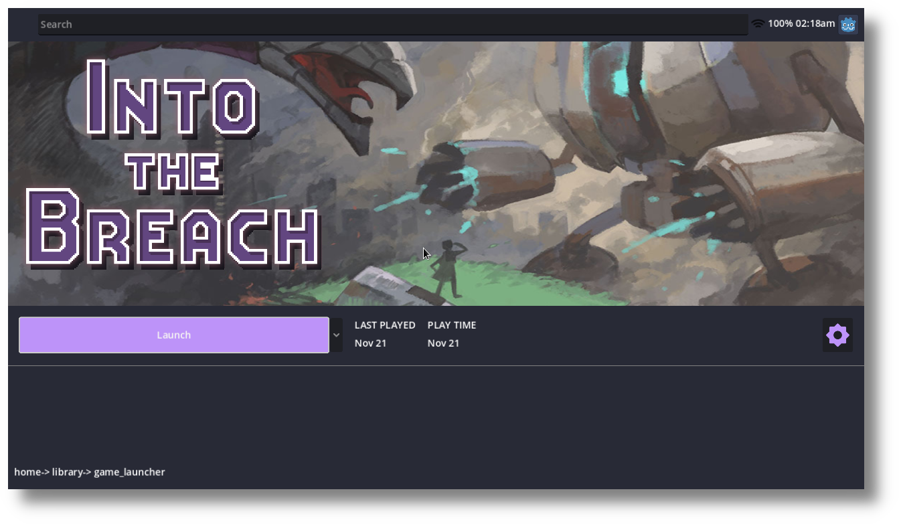

# OpenGamepadUI SteamGridDB

SteamGridDB box art provider for [OpenGamepadUI](https://github.com/ShadowBlip/OpenGamepadUI).



## Requirements

In order to use this plugin, you must log in to SteamGridDB at https://www.steamgriddb.com and create an API key [here](https://www.steamgriddb.com/profile/preferences/api).

Enter your API key in the plugin settings menu after installation.

## Usage

```bash
make install
```
